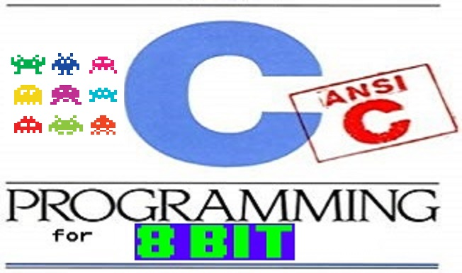

---

---

<h1 id="c-portabile-e-ottimizzato-per-gli-8-bit">C portabile e ottimizzato per gli 8-bit</h1>
<h2 id="seconda-parte-tecniche-per-ottimizzare-il-codice-c-per-8-bit"><em>Seconda parte</em>: Tecniche per ottimizzare il codice C per 8-bit</h2>

Questa è la seconda parte di una serie di tre articoli che descrivono tecniche per scrivere codice portabile e ottimizzato in ANSI C per <strong>tutti</strong> i sistemi 8-bit <em>vintage</em>, cioè computer, console, handheld, calcolatrici scientifiche e microcontrollori dalla fine degli anni 70 fino a metà degli anni 90. 
L’articolo completo è disponibile on-line su <a href="https://github.com/Fabrizio-Caruso/8bitC/blob/master/8bitC.md">https://github.com/Fabrizio-Caruso/8bitC/blob/master/8bitC.md</a>

Consigliamo la lettura del primo articolo in cui abbiamo presentato i vari cross compilatori C per architetture 8 bit e abbiamo dato alcune indicazioni su come scrivere codice C portabile su tutte le architetture 8 bit.

<h2 id="ottimizzare-il-codice-in-generale">Ottimizzare il codice in generale</h2>

Ci sono alcune regole generali per scrivere codice migliore indipendentemente dal fatto che l’architettura sia 8-bit o meno.

<h3 id="riutilizziamo-le-stesse-funzioni">Riutilizziamo le stesse funzioni</h3>

In generale, in qualunque linguaggio di programmazione si voglia programmare, è importante evitare la duplicazione del codice o la scrittura di codice superfluo.

<h4 id="programmazione-strutturata">Programmazione strutturata</h4>

Spesso guardando bene le funzioni che abbiamo scritto scopriremo che condividono delle parti comuni e che quindi potremo <em>fattorizzare</em> costruendo delle <em>sotto-funzioni</em> che le nostre funzioni chiameranno. 
Dobbiamo però tenere conto che, oltre un certo limite, una eccessiva granularità del codice ha effetti deleteri perché una chiamata ad una funzione ha un costo computazionale e di memoria.

<h4 id="generalizzare-il-codice-parametrizzandolo">Generalizzare il codice parametrizzandolo</h4>

In alcuni casi è possibile generalizzare il codice passando un parametro per evitare di scrivere due funzioni diverse molto simili.

<h5 id="passiamo-delle-variabili">Passiamo delle variabili</h5>

Se due funzioni fanno la stessa cosa su oggetti diversi, sarebbe meglio avere una unica funziona che faccia la stessa cosa a cui si passi l’oggetto.

<h5 id="passiamo-delle-funzioni">Passiamo delle funzioni</h5>

In altri casi avremo due funzioni simili la cui unica differenza è l’applicazione di una funzione diversa. In questo caso possiamo scrivere un’unica funzione a cui si passa un puntatore a funzione.

<h5 id="passiamo-degli-offset-di-struct">Passiamo degli offset di <code>struct</code></h5>

In altri casi possiamo avere due funzioni identiche la cui unica differenza è il campo di uno <code>struct</code> che si modifica. In questo caso possiamo scrivere un’unica funzione a cui passiamo l’<em>offset</em> dello <code>struct</code>.

Un esempio avanzato si trova in <a href="https://github.com/Fabrizio-Caruso/CROSS-CHASE/blob/master/src/chase/character.h">https://github.com/Fabrizio-Caruso/CROSS-CHASE/blob/master/src/chase/character.h</a> dove, dato uno <code>struct</code> con due campi <code>_x</code> e <code>_y</code>,  vogliamo potere agire sul valore di uno o dell’altro in situazioni diverse:

<pre><code>	struct CharacterStruct
	{
		unsigned char _x;
		unsigned char _y;
		...
	};
	typedef struct CharacterStruct Character;
</code></pre>

Possiamo evitare di scrivere due diverse funzioni per agire su <code>_x</code> e su <code>_y</code> creando una unica funzione a cui si passa un <em>offset</em> che faccia da selettore:

<pre><code>	unsigned char moveCharacter(Character* hunterPtr, unsigned char offset)
	{
		if((unsigned char) * ((unsigned char*)hunterPtr+offset) &lt; ... )
		{
			++(*((unsigned char *) hunterPtr+offset));
		}
		else if((unsigned char) *((unsigned char *) hunterPtr+offset) &gt; ... )
		{
			--(*((unsigned char *) hunterPtr+offset));
		}
	...
	}
</code></pre>

Nel caso sopra stiamo sfruttando il fatto che il secondo campo <code>_y</code> si trova esattamente un byte dopo il primo campo <code>_x</code>. Quindi con <code>offset=0</code> accediamo al campo <code>_x</code> e con <code>offset=1</code> accediamo al campo <code>_y</code>.

<strong>Avvertenze</strong>: Dobbiamo però considerare sempre che aggiungere un parametro ha un costo e quindi dovremo verificare (anche guardando la taglia del binario ottenuto) se nel nostro caso ha un costo inferiore al costo di una funzione aggiuntiva.

<h4 id="stesso-codice-su-oggetti-simili">Stesso codice su <em>oggetti</em> simili</h4>

Si può anche fare di più e usare lo stesso codice su <em>oggetti</em> che non sono esattamente dello stesso tipo ma che condividono solo alcuni aspetti comuni per esempio sfruttando gli <code>offset</code> dei campi negli <code>struct</code>, <em>puntatori a funzioni</em>, etc. 
Questo è possibile in generale tramite la <em>programmazione ad oggetti</em> di cui descriviamo una implementazione leggera per gli 8-bit in una sezione successiva.

<h3 id="pre-incrementodecremento-vs-post-incrementodecremento">Pre-incremento/decremento vs Post-incremento/decremento</h3>

Bisogna evitare operatori di post-incremento/decremento (<code>i++</code>, <code>i--</code>) quando non servono (cioè quando non serve il valore pre-incremento) e sostituirli con (<code>++i</code>, <code>--i</code>). 
Il motivo è che l’operatore di post-incremento richiede almeno una operazione in più dovendo conservare il valore originario. 
Nota: E’ totalmente inutile usare un operatore di post-incremento in un ciclo <code>for</code>.

<h3 id="costanti-vs-variabili">Costanti vs Variabili</h3>

Una qualunque architettura potrà ottimizzare meglio del codici in cui delle variabili sono sostituite con delle costanti.

<h4 id="usiamo-costanti">Usiamo costanti</h4>

Quindi se una data variabile ha un valore noto al momento della compilazione, è importante che sia rimpiazzata con una costante. 
Se il suo valore, pur essendo noto al momento della compilazione, dovesse dipende da una opzione di compilazione, allora la sostituiremo con una <em>macro</em> da settare attraverso una opzione di compilazione, in maniera tale che sia trattata come una costante dal compilatore.

<h4 id="aiutiamo-il-compilatore-a-ottimizzare-le-costanti">Aiutiamo il compilatore a ottimizzare le costanti</h4>

Inoltre, per compilatori <em>single pass</em> (come la maggioranza dei cross-compilatori 8-bit come per esempio CC65), può essere importante aiutare il compilatore a capire che una data espressione sia una costante.

<strong><em>Esempio</em></strong> (preso da <a href="https://www.cc65.org/doc/coding.html">https://www.cc65.org/doc/coding.html</a>): 
Un compilatore <em>single pass</em> valuterà la seguente espressione da sinistra a destra non capendo che <code>OFFS+3</code> è una costante.

<pre><code>	#define OFFS   4
	int  i;
	i = i + OFFS + 3;
</code></pre>

Quindi sarebbe meglio riscrivere <code>i = i + OFFS+3</code> come <code>i = OFFS+3+i</code> oppure <code>i = i + (OFFS+3)</code>.

<h2 id="ottimizzare-il-codice-per-gli-8-bit">Ottimizzare il codice per gli 8-bit</h2>

Il C è un linguaggio che presenta sia costrutti ad alto livello (come <code>struct</code>, le funzioni come parametri, etc.) sia costruiti a basso livello (come i puntatori e la loro manipolazione). Questo non basta per farne un linguaggio direttamente adatto alla programmazione su macchine 8-bit.

<h3 id="implementare-peek-e-poke-in-c">Implementare <code>peek</code> e <code>poke</code> in C</h3>

Quasi sicuramente avremo bisogno di fare scrivere e leggere dei singoli byte su alcune specifiche locazioni di memoria. 
Il modo per fare questo è in BASIC sarebbe attraverso i comando <code>peek</code> e <code>poke</code>. 
In C dobbiamo farlo attraverso dei puntatori la cui sintassi non è legibilissima. Potremo però costruirci delle utili macro che useremo nel nostro codice:

<pre><code>    #define POKE(addr,val)  (*(unsigned char*) (addr) = (val))
    #define PEEK(addr)      (*(unsigned char*) (addr))
</code></pre>

Nota: I compilatori scriveranno codice ottimale nel caso in cui si passino delle costanti come parametri.

Per maggiori dettagli facciamo riferimento a: <a href="https://github.com/cc65/wiki/wiki/PEEK-and-POKE">https://github.com/cc65/wiki/wiki/PEEK-and-POKE</a>

<h3 id="i-tipi-migliori-per-gli-8-bit">I “tipi migliori” per gli 8-bit</h3>

Una premessa importante per la scelta dei tipi da preferire per architettura è data dal fatto che in generale abbiamo questa situazione:

<ul>
<li>tutte le operazioni aritmetiche sono solo a 8 bit</li>
<li>la maggior parte delle operazioni sono ad 8 bit, alcune sono a 16-bit e nessuna operazione è a 32 bit</li>
<li>le operazioni <code>signed</code> (cioè con segno) sono più lente di quelle <code>unsigned</code></li>
<li>l’hardware non supporta operazioni in <em>virgola mobile</em></li>
</ul>
<h4 id="tipi-interi-vs-tipi-a-virgola-mobile">Tipi interi vs tipi a virgola mobile</h4>

Il C prevede tipi numerici interi con segno (<code>char</code>, <code>short</code>, <code>int</code>, <code>long</code>, <code>long long</code> e loro equivalenti in versione <code>unsigned</code>). 
Molti compilatori (ma non CC65) prevedono il tipo <code>float</code> (numeri a <em>virgola mobile</em>) che qui non tratteremo. Bisogna considerare che i <code>float</code> delle architetture 8-bit sono tutti <em>software float</em> ed hanno quindi un costo computazionale notevole. Sarebbero quindi da usare solo se strettamente necessari.

<h4 id="il-nostro-amico-unsigned">Il nostro amico <em>unsigned</em></h4>

Siccome le architetture 8-bit che stiamo considerandno <strong>NON</strong> gestiscono ottimalmente tipi <code>signed</code>, dobbiamo evitare il più possibile l’uso di tipi numerici <code>signed</code>.

<h4 id="size-matters">“Size matters!”</h4>

La dimensione dei tipi numeri standard dipende dal compilatore e dall’architettura e non dal linguaggio. 
Più recentemente sono stati introdotti dei tipi che fissano la dimensione in modo univoco (come per esempio <code>uint8_t</code> per l’intero <code>unsigend</code> a 8 bit). 
Il modo standard per includere questi tipi a taglia fissa

<pre><code>	#include &lt;stdint.h&gt;
</code></pre>

Non tutti i compilatori 8-bit dispongono di questi tipi.

Fortunatamente per la stragrande maggioranza dei compilatori 8-bit abbiamo la seguente situazione:

<table>
<thead>
<tr>
<th>tipo</th>
<th>numero bit</th>
<th>equivalente</th>
</tr>
</thead>
<tbody>
<tr>
<td><code>unsigned char</code></td>
<td>8</td>
<td><code>uint8_t</code></td>
</tr>
<tr>
<td><code>unsigned short</code></td>
<td>16</td>
<td><code>uint16_t</code></td>
</tr>
<tr>
<td><code>unsigned int</code></td>
<td>16</td>
<td><code>uint16_t</code></td>
</tr>
<tr>
<td><code>unsigned long</code></td>
<td>32</td>
<td><code>uint32_t</code></td>
</tr>
</tbody>
</table>
Quindi dovremo:

<ul>
<li>usare il più possibile <code>unsigned char</code> (o <code>uint8_t</code>) per le operazioni aritmetiche;</li>
<li>usare <code>unsigned char</code> (o <code>uint8_t</code>) e <code>unsigned short</code> (o <code>uint16_t</code>) per tutte le altre operazioni, evitando se possibile qualunque operazione a 32 bit.</li>
</ul>

Nota: In assenza di tipi con dimensione fissata, sarebbe una buona pratica creare dei <code>typedef</code> opportuni:

<pre><code>	typedef unsigned char uint8_t;
	typedef unsigned short uint16_t;
	typedef unsigned long uint32_t;
</code></pre>
<h3 id="scelta-delle-operazioni">Scelta delle operazioni</h3>

Quando scriviamo codice per una architettura 8-bit dobbiamo evitare se possibile codice con operazioni inefficienti o che ci obblighino a usare tipi non adatti (come i tipi <code>signed</code> o tipi a 16 o peggio 32 bit).

<h4 id="non-produciamo-signed">Non produciamo <em>signed</em></h4>

In particolare, se possibile, spesso si può riscrivere il codice in maniera da evitare sottrazioni e quando questo non è possibile, si può almeno fare in modo che il risultato della sottrazione sia sempre non-negativo.

<h4 id="evitiamo-i-prodotti-espliciti">Evitiamo i prodotti espliciti</h4>

Tutte le architetture che abbiamo preso in considerazione, con la sola esclusione di Motorola 6809, non dispongono di una operazione per effettuare il prodotto di due valori a 8 bit. 
Quindi, se possibile dobbiamo evitare i prodotti adattando il nostro codice, oppure limitarci a prodotti e divisioni che siano potenze di 2 e implementandoli con operazioni di shift con gli operatori <em>&lt;&lt;</em> e <em>&gt;&gt;</em>:

<pre><code>	unsigned char foo, bar;
	...
	foo &lt;&lt; 2; // moltiplicazione per 2^2=4
	bar &gt;&gt; 1; // divisione per 2^1=2
</code></pre>
<h4 id="riscrivere-certe-operazioni">Riscrivere certe operazioni</h4>

Molte operazioni come il modulo possono essere riscritte in maniera più efficiente per gli 8 bit usando operatori bit a bit. Non sempre il compilatore ottimizza nel modo migliore. Quando il compilatore non ce la fa, dobbiamo dargli una mano noi:

<pre><code>	unsigned char foo;
	...
	if(foo&amp;1) // equivalente a foo%2
	{
		...
	}
</code></pre>
<h3 id="variabili-e-parametri">Variabili e parametri</h3>

Uno dei più grossi limiti dell’architettura MOS 6502 non è la penuria di registri come si potrebbe pensare ma è la dimensione limitata del suo <em>stack hardware</em> (in <em>pagina uno</em>: <code>$0100-01FF</code>) che lo rende inutilizzabile in C per la gestioni dello <em>scope</em> delle variabili e i parametri delle funzioni. 
Quindi un compilatore ANSI C per 6502 sarà quasi sicuramente costretto a usare uno <em>stack software</em> per

<ul>
<li>gestire lo scope delle variabili,</li>
<li>gestire il passaggio dei parametri.</li>
</ul>

Le altre architetture 8-bit che stiamo considerando soffrono meno di questo problema ma la gestione delle scope delle variabili e dei parametri ha un costo anche quando si usa uno <em>stack hardware</em>.

<h4 id="un-antipattern-può-aiutarci">Un <em>antipattern</em> può aiutarci</h4>

Un modo per ridurre il problema è limitare l’uso delle variabili locali e dei parametri passati alle funzioni. Questo è chiaramente un <em>antipattern</em> e se lo applicassimo a tutto il nostro codice otterremo il classico <em>spaghetti code</em>. Dobbiamo quindi scegliere sapientemente quali variabili sono assolutamente locali e quali possono essere usate come globali. Avremo codice meno generico di quello che avremmo voluto ma sarà più efficiente. <strong>NON</strong> sto suggerendo di rendere tutte le variabili globali e di non passare mai parametri alle funzioni.

<h4 id="usare-funzioni-non-re-entrant">[6502] Usare funzioni non re-entrant</h4>

Il compilatore CC65 per l’architettura MOS 6502 mette a disposizione l’opzione <code>-Cl</code> che rende tutte le variabili locali come <code>static</code>, quindi globali. Questo ha l’effetto di evitare l’uso dello <em>stack software</em> per il loro scope. Ha però l’effetto di rendere tutte le nostre funzioni non re-entrant. In pratica questo ci impedisce di usare funzioni recursive. Questa non è un grave perdita perché la ricorsione sarebbe comunque una operazione troppo costosa per una architettura 8-bit.

<h4 id="usare-la-pagina-zero">[6502] Usare la pagina zero</h4>

Il C standard prevede la keyword <code>register</code> per suggerire al compilatore di mettere una variabile in un registro. 
In genere i compilatori moderni ignorano questa keyword perché lasciano questa scelta ai loro ottimizzatori. Questo è vero per i compilatori in questione ad eccezione di quello presenti in CC65 che la usa come suggerimento al compilatore per mettere una variabile in <em>pagina zero</em>. Il MOS 6502 accede in maniera più efficiente a tale pagina di memoria. Si può guadagnare memoria e velocità. 
Per quanto riguarda l’architettura MOS 6502, il sistema operativo di queste macchine usa una parte della pagina zero. Resta comunque una manciata di byte a disposizione del programmatore. 
CC65 per default lascia 6 byte della pagina zero a disposizione delle variabili dichiarate con keyword <code>register</code>. 
Potrebbe sembrare quindi ovvio dichiarare molte variabili come <code>register</code> ma <strong>NON</strong> è così semplice perché tutto ha un costo. Per mettere una variabile sulla <em>pagina zero</em> sono necessarie diverse operazioni. Quindi se ne avrà un vantaggio quando le variabili sono molto usate. 
In pratica i due scenari in cui è conveniente sono:

<ol>
<li>parametri di tipo puntatore a <code>struct</code> usati almeno 3 volte all’interno di una funzione</li>
<li>variabile in un loop che si ripete almeno un centinaio di volte</li>
</ol>

Un riferimento più preciso è dato da: <a href="https://www.cc65.org/doc/cc65-8.html">https://www.cc65.org/doc/cc65-8.html</a>

Il mio consiglio è quello di compilare e vedere se il binario è divenuto più breve.

<h3 id="struttura-ottimale-del-binario">Struttura ottimale del binario</h3>

Se il nostro programma prevede dei dati in una definita area di memoria, sarebbe meglio metterli direttamente nel binario che verrà copiato in memoria durante il caricamento. Se questi dati sono invece nel codice, saremo costretti a scrivere del codice che li copia nell’area di memoria in cui sono previsti. 
Il caso più comune è forse quello degli sprites e dei caratteri/tiles ridefiniti.

Spesso (ma non sempre) le architetture basate su MOS 6502 prevedono video <em>memory mapped</em> in cui i dati della grafica si trovano nella stessa RAM a cui accede la CPU.

Molte architetture basate su Z80 (MSX, Spectravideo, Memotech, Tatung Einstein, etc.) usano il chip Texas VDP che invece ha una memoria video dedicata. Quindi non potremo mettere la grafica direttamente in questa memoria.

<h4 id="cc65-istruiamo-il-linker">[CC65] Istruiamo il linker</h4>

Ogni compilatore mette a disposizioni strumenti diversi per definire la struttura del binario e quindi permetterci di costruirlo in maniera che i dati siano caricati in una determinata zona di memoria durante il load del programma senza uso di codice aggiuntivo. 
In particolare su CC65 si può usare il file .cfg di configurazione del linker che descrive la struttura del binario che vogliamo produrre. 
Il linker di CC65 non è semplicissimo da configurare ed una descrizione andrebbe oltre lo scopo di questo articolo. 
Una descrizione dettagliata è presente su: 
<a href="https://cc65.github.io/doc/ld65.html">https://cc65.github.io/doc/ld65.html</a> 
Il mio consiglio è di leggere il manuale e di modificare i file di default .cfg già presenti in CC65 al fine di adattarli al proprio use-case.

<h5 id="exomizer-ci-aiuta-anche-in-questo-caso">Exomizer ci aiuta (anche) in questo caso</h5>

In alcuni casi se la nostra grafica deve trovarsi in un’area molto lontana dal codice, e vogliamo creare un unico binario, avremo un binario enorme e con un “buco”. Questo è il caso per esempio del C64 in cui la grafica per caratteri e sprites può trovarsi lontana dal codice. In questo caso io suggerisco di usare <em>exomizer</em> sul risultato finale: <a href="https://bitbucket.org/magli143/exomizer/wiki/Home">https://bitbucket.org/magli143/exomizer/wiki/Home</a>

<h4 id="z88dk-appmake-fa-quasi-tutto-per-noi">[Z88DK] <em>Appmake</em> fa (quasi) tutto per noi</h4>

Z88DK fa molto di più e il suo potente tool <em>appmake</em> costuisce dei binari nel formato richiesto. 
Z88DK consente comunque all’utente di definire sezioni di memoria e di definire il “packaging” del binario ma non è semplice. 
Questo argomento è trattato in dettaglio in 
<a href="https://github.com/z88dk/z88dk/issues/860">https://github.com/z88dk/z88dk/issues/860</a>

<h3 id="codice-su-file-diversi">Codice su file diversi?</h3>

In generale è bene separare in più file il proprio codice se il progetto è di grosse dimensioni. 
Questa buona pratica può però avere degli effetti deleteri per gli ottimizzatori dei compilatori 8-bit perché in generale non eseguono <em>link-time optimization</em>, cioè non ottimizzeranno codice tra più file ma si limitano ad ottimizzare ogni file singolarmente. 
Quindi se per esempio abbiamo una funzione che chiamiamo una sola volta e la funzione è definita nello stesso file in cui viene usata, l’ottimizzatore potre metterla <em>in line</em> ma non lo farà se la funzione è definita in un altro file. 
Il mio consiglio <strong>non</strong> quello di creare file enormi con tutto ma è quello di tenere comunque conto di questo aspetto quando si decide di separare il codice su più file e di non abusare di questa buona pratica.

<h2 id="programmazione-ad-oggetti">Programmazione ad oggetti</h2>

Contrariamente a quello che si possa credere, la programmazione ad oggetti è possibile in ANSI C e può aiutarci a produrre codice più compatto in alcune situazioni. Esistono interi framework ad oggetti che usano ANSI C (es. Gnome è scritto usando <em>GObject</em> che è uno di questi framework).

Nel caso delle macchine 8-bit con vincoli di memoria molto forti, possiamo comunque implementare <em>classi</em>, <em>polimorfismo</em> ed <em>ereditarietà</em> in maniera molto efficiente. 
Una trattazione dettagliata non è possibile in questo articolo e qui ci limitiamo a citare i due strumenti fondamentali:

<ul>
<li>usare <em>puntatori a funzioni</em> per ottenere metodi <em>polimorfici</em>, cioè il cui <em>binding</em> (e quindi comportamento) è dinamicamente definito a <em>run-time</em>. Si può evitare l’implementazione di una <em>vtable</em> se ci si limita a classi con un solo metodo polimorfico.</li>
<li>usare <em>puntatori a</em> <code>struct</code> e <em>composizione</em> per implementare sotto-classi: dato uno <code>struct</code> A, si implementa una sua sotto-classe con uno <code>struct</code> B definito come uno <code>struct</code> il cui <strong>primo</strong> campo è A. Usando puntatori a tali <code>struct</code>, il C garantisce che gli <em>offset</em> di B siano gli stessi degli offset di A.</li>
</ul>

Esempio (preso da <a href="https://github.com/Fabrizio-Caruso/CROSS-CHASE/tree/master/src/chase">https://github.com/Fabrizio-Caruso/CROSS-CHASE/tree/master/src/chase</a>) 
Definiamo <code>Item</code> come un sotto-classe di <code>Character</code> a cui aggiungiamo delle variabili ed il metodo polimorfico <code>_effect()</code>:

<pre><code>	struct CharacterStruct
	{
		unsigned char _x;
		unsigned char _y;
		unsigned char _status;
		Image* _imagePtr;
	};
	typedef struct CharacterStruct Character;
...
 	struct ItemStruct
	{
		Character _character;
		void (*_effect)(void);
		unsigned short _coolDown;
		unsigned char _blink;
	};
	typedef struct ItemStruct Item;
</code></pre>

e poi potremo passare un puntatore a <code>Item</code> come se fosse un puntatore a <code>Character</code> (facendo un semplice <em>cast</em>):

<pre><code>	Item *myItem;
	void foo(Character * aCharacter);
	...
	foo((Character *)myItem);
</code></pre>

Perché ci guadagniamo in termine di memoria? 
Perché sarà possibile trattare più oggetti con lo stesso codice e quindi risparmiamo memoria.

